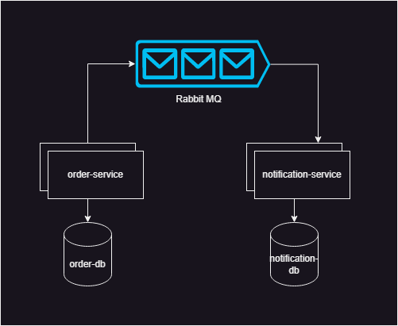

# Go Shopping

This is an application consisting of two microservices: Order Service and Notification Service. The Order Service is responsible for creating orders, saving them in a PostgreSQL database, and publishing order events to a RabbitMQ message queue. The Notification Service consumes messages from the RabbitMQ queue and sends notifications to customers.

## Architecture

## Technologies Used

- PostgreSQL
- RabbitMQ
- Docker

## Prerequisites

Before running the application, ensure that the following dependencies are installed:

- Docker: [Installation Guide](https://docs.docker.com/get-docker/)
- Docker Compose: [Installation Guide](https://docs.docker.com/compose/install/)

## Getting Started

1. Clone the repository: `git clone https://github.com/killswitchh/go-shopping.git`
2. Navigate to the project directory: `cd go-shopping`
3. Start the application and its dependencies using Docker Compose:
4. `docker-compose up` 
5. The microservices will be accessible at the following endpoints:
- Order Service: http://localhost:5050

## Usage

- Use the Order Service to create orders by making HTTP POST requests to the appropriate endpoint.
- The Order Service will save the order details in the PostgreSQL database and publish an event to the RabbitMQ queue.
- The Notification Service will consume the order events from the RabbitMQ queue and send notifications to the respective customers.

## Additional Notes

- Ensure that the required ports are not in use by other services on your local machine.
- Adjust the configuration files and environment variables according to your specific needs.

## Contributing

Contributions are welcome! If you find any issues or have suggestions for improvements, please open an issue or submit a pull request.

## License

This project is licensed under the [MIT License](LICENSE).